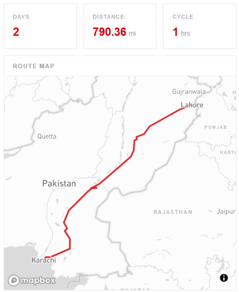

# ELD Trip Planner & HOS Simulator

A full-stack truck driver trip planning system that generates FMCSA-compliant Hours of Service (HOS) logs, visualizes routes, and helps drivers plan long-haul trips efficiently.

> Built with Next.js, TypeScript, Django REST Framework, and Mapbox.


## Live Demo

🚀 https://eld-frontend-pymc.vercel.app/

---

## Overview

Truck drivers must comply with strict Hours of Service (HOS) regulations that govern driving time, mandatory breaks, duty limits, and rest periods. Planning long-distance trips while remaining compliant can be complex and time-consuming.

The ELD Trip Planner automates this process by calculating routes, estimating trip metrics, and generating Electronic Logging Device (ELD) logs based on HOS rules. Users can enter trip locations and receive a complete trip breakdown, including driving periods, rest stops, cycle-hour tracking, and route visualization.

---

## Features

- Interactive route planning between locations
- Automated HOS-compliant ELD log generation
- Route visualization using Mapbox
- Trip distance and duration estimation
- Driving, on-duty, off-duty, and sleeper berth calculations
- Rest break and stop planning
- Multi-day trip simulation
- Cycle hour tracking
- Fuel stop recommendations
- Real-world logistics workflow simulation

---

## Tech Stack

### Frontend

- Next.js
- React
- TypeScript
- Tailwind CSS
- Mapbox GL JS

### Backend

- Django
- Django REST Framework

### APIs & Services

- Mapbox Directions API
- Mapbox Geocoding API

---

## How It Works

1. User enters:
   - Current Location
   - Pickup Location
   - Dropoff Location
   - Previously Used Cycle Hours

2. Backend retrieves route data from Mapbox.

3. HOS simulation engine processes:
   - 11-Hour Driving Limit
   - 14-Hour Duty Window
   - 30-Minute Break Requirement
   - 10-Hour Reset Rule
   - 70-Hour Cycle Rule
   - Fuel Stop Planning

4. System generates:
   - Route Visualization
   - Trip Metrics
   - Stop Recommendations
   - ELD Logs

---

## Architecture

```text
┌─────────────────────┐
│     Next.js UI      │
└──────────┬──────────┘
           │
           ▼
┌─────────────────────┐
│ Django REST API     │
└──────────┬──────────┘
           │
   ┌───────┴────────┐
   │                │
   ▼                ▼
Mapbox APIs     HOS Engine
(Route Data)   (Business Logic)
   │                │
   └───────┬────────┘
           ▼
      ELD Logs
      Trip Metrics
      Stop Planning
```

---

## Screenshots

### Trip Details


### Route Planning



### Generated ELD Logs


---

## Project Structure

### Frontend

```text
eld-frontend/
├── app/
├── components/
├── lib/
├── types/
├── public/
└── styles/
```

### Backend

```text
eld-backend/
├── api/
├── services/
├── simulations/
├── serializers/
├── views/
└── models/
```

---

## Source Code

### Frontend Repository

[https://github.com/your-username/eld-frontend](https://github.com/aownaamir/eld-frontend)

### Backend Repository

[https://github.com/your-username/eld-backend](https://github.com/aownaamir/eld-backend)

---

## Key Challenges

### Implementing Real HOS Regulations

One of the biggest challenges was converting real-world trucking regulations into programmatic business logic while ensuring generated logs remained realistic and compliant.

### Multi-Day Trip Simulation

Long-haul trips required handling multiple driving cycles, mandatory rest periods, duty windows, and cycle-hour calculations across several days.

### Route & Logistics Integration

Combining route data with HOS calculations required synchronizing travel time, distance, fuel stops, and break scheduling into a single planning workflow.

---

## What I Learned

- Building production-style full-stack applications
- Designing rule-based simulation systems
- Working with mapping and routing APIs
- Handling complex business logic
- Integrating React applications with Django REST APIs
- Structuring scalable frontend and backend architectures

---

## Future Improvements

- User authentication
- Driver profiles
- Trip history
- PDF export for ELD logs
- Fleet management support
- Real-time traffic integration
- Weather-aware route planning
- Fuel cost estimation

---

## Author

### Aown Aamir

Electrical Engineering Graduate — NUST

Full Stack Developer focused on building practical web and mobile applications using React, Next.js, React Native, Node.js, Django, and modern cloud technologies.

- Portfolio: https://aown-aamir.vercel.app
- LinkedIn: https://linkedin.com/in/aown-aamir

---

⭐ If you found this project interesting, consider giving it a star.
