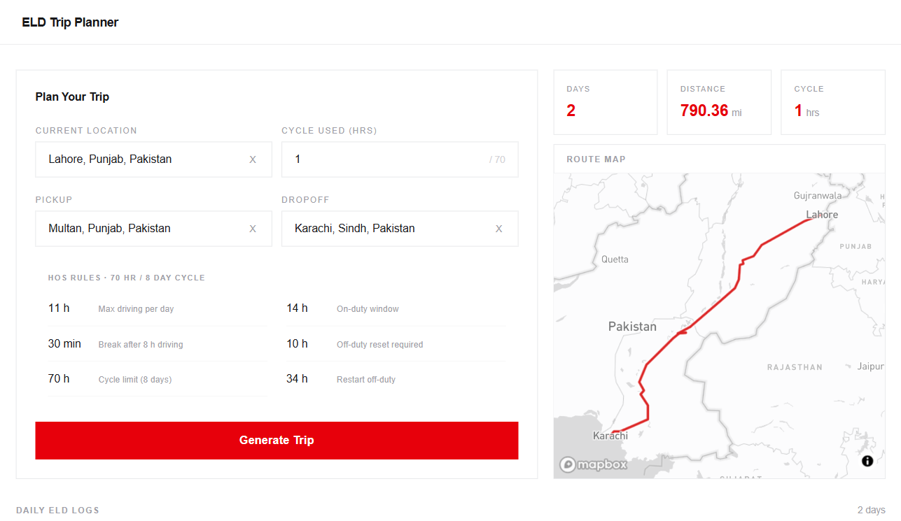
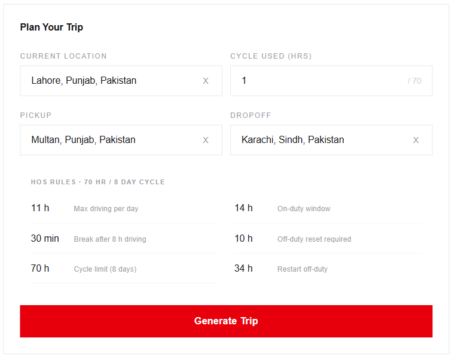
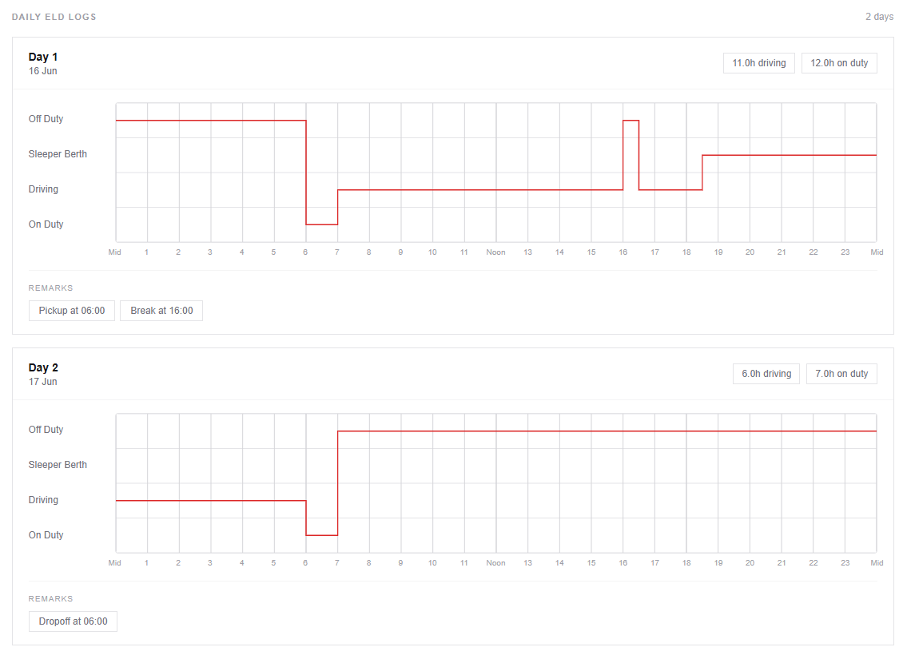

# ELD Logbook System

A full-stack Hours of Service (HOS) planning and Electronic Logging Device (ELD) simulation platform for truck drivers.

The system calculates routes, generates ELD logs, recommends rest breaks, tracks cycle hours, and ensures FMCSA compliance.

---

## Live Demo

Frontend:
https://your-app.vercel.app

---

## Source Code

Frontend:
https://github.com/yourusername/eld-frontend

Backend:
https://github.com/yourusername/eld-backend

---

## Features

- Route Planning
- HOS Compliance Engine
- ELD Log Generation
- 30-Minute Break Rules
- 10-Hour Reset Logic
- 34-Hour Restart Logic
- Fuel Stop Planning
- Interactive Map

---

## Tech Stack

### Frontend

- Next.js
- TypeScript
- Tailwind CSS
- Mapbox

### Backend

- Django
- Django REST Framework

---

## Screenshots

---

## Architecture

